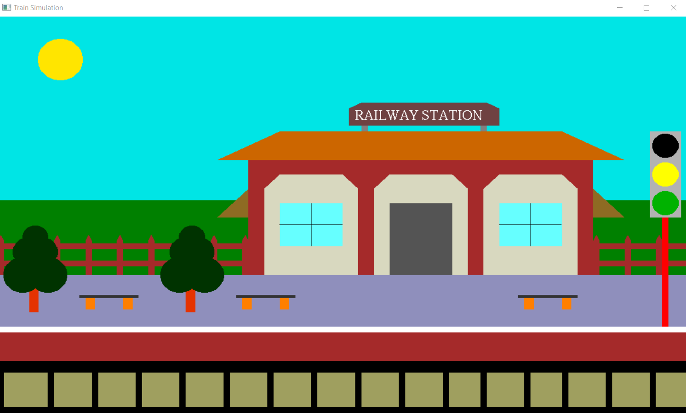
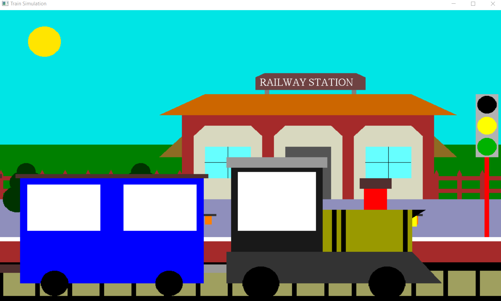
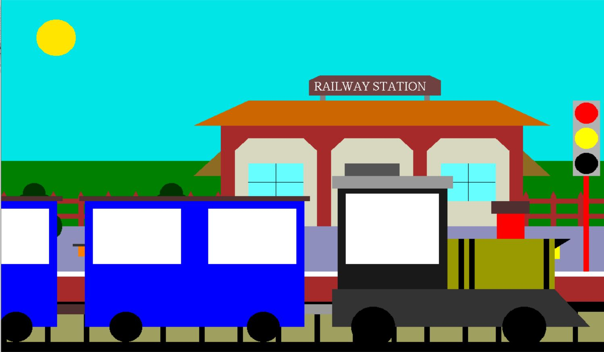
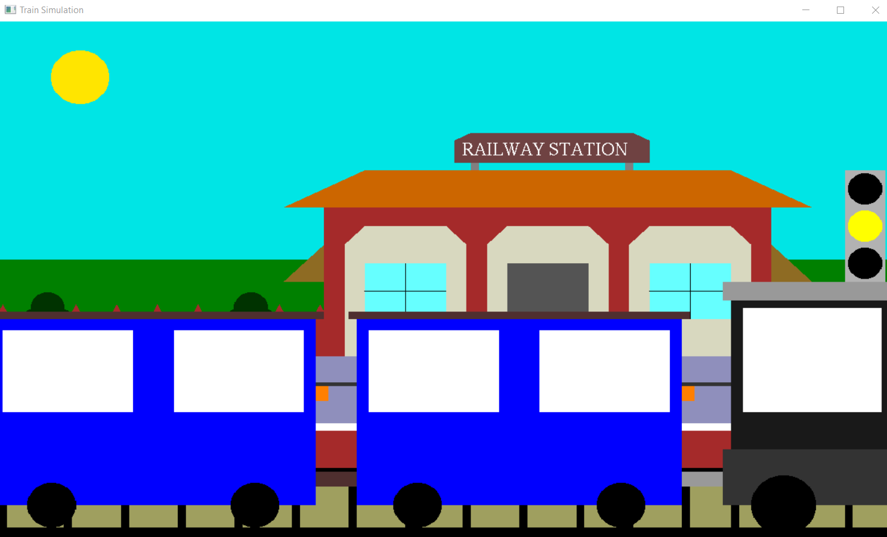

# Computer-Graphics-Innovative-Project
## About
Main aim of this Project is to illustrate the concepts and usage of pre-built functions in OpenGL.
Train arrival and departure project simulates the railway passing through a station.
When the signal is red the train arrives at the platform and just stops and when the signal is green, The train does not stop .
We have used input devices like mouse and keyboard to interact with program       

Created by Rohit Bajad (2K18/CO/300) and Rohit (2K18/CO/301) as a 5th semester Project in Computer Graphics.

## System Specifications
### Software Requirements:
- CodeBlocks
- OpenGl
- C++

### Hardware Requirements:
- Graphics System
- Pentium P4 with 256 of Ram(Min)

To get started run code.cpp.

## Screenshots

